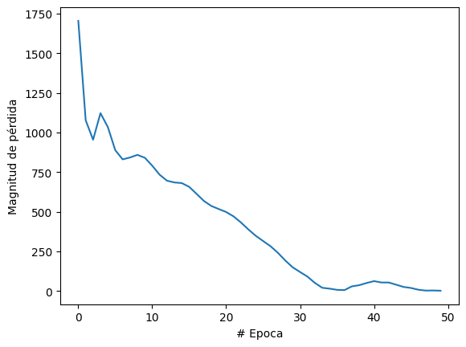

#

## Utilizamos una red neuronal densa para desarrollar nuestro algoritmo, el cual esta dedicado a realizar conversiones de temperatura, específicamente de Celsius a Fahrenheit.

### La Librería Keras, se utilizara para crear las capas neuronales utilizando el modelo secuencial.

### La librería matplotlib.pyplot nos permite validar por medio de una gráfica el avance de aprendizaje por cada ciclo que realiza el sistema.

